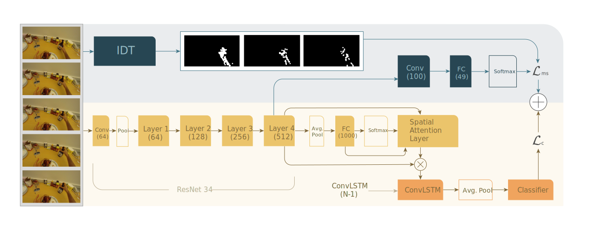
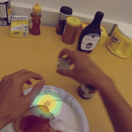
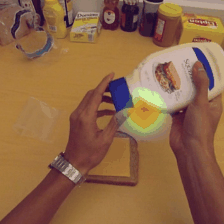
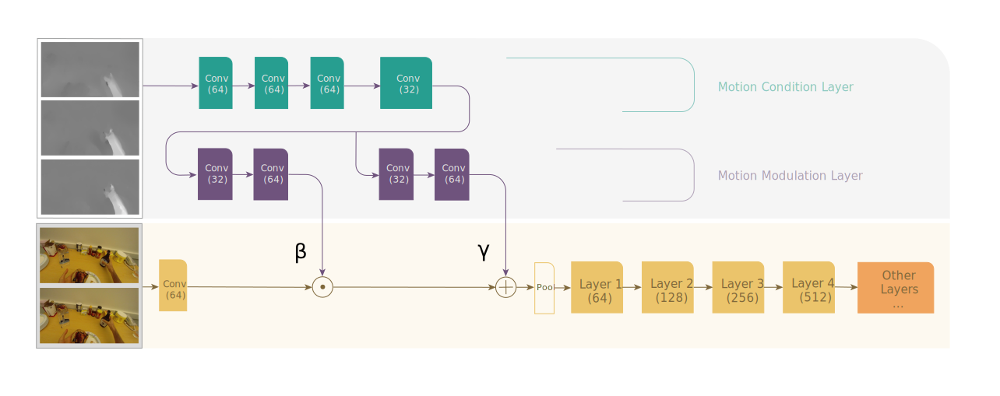
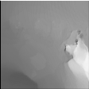

# First Person Action Recognition: different approaches exploiting Self-Supervised Task and 2-in-1 Flow Modulation
#### A work by Paolo Alberto, Lorenzo De Nisi, Carmine De Stefano

While the classification of third-person human actions has seen a lot of progress in the last decade, the more niche task of detecting first-person actions can still be considered as a less explored field, and has seen some interesting developments in recent years.
With this model we explore different methods for performing a first person action recognition task on the [GTEA61](http://cbs.ic.gatech.edu/fpv/) dataset, starting from [Ego-RNN](https://github.com/swathikirans/ego-rnn): a two stream architecture that works separately on the frames of the videos and on motion features extracted from optical flow. Details for all the steps are provided in the available [paper](https://github.com/FPAR-NET/FPAR/raw/master/paper.pdf).

## Adding a self-supervised task to Ego-RNN

Ego-RNN is a network from the 2018 [paper](https://arxiv.org/abs/1807.11794): "Attention is All We Need: Nailing Down Object-centric Attention for Egocentric Activity Recognition", and it is used as the starting point for our architecture. One of the problems of this model is that frames and optical flow features are learned separately, merging the two branches only at the end of training. Taking this into account, we expand on this architecture by implementing a self-supervised motion segmentation task, and we feed the backbone of the Ego-RNN network to it. As a result of the added MS task, the backbone will try to learn features regarding the object movements, that are supposed to be beneficial to the classification task. The complete schema of the final self-supervised model is pictured in the image below:

## Class activation maps
The original Ego-RNN model makes use of class specific saliency maps, capable of identifying the image regions that are been used by the CNN to identify the class under consideration. However, oftentimes these maps cannot be considered as representative of the activity. As we can see from the animations below, the addition of the MS task proved to be helpful for the identification of the correct regions.

Before MS task  |  After MS task 
:-------------------------:|:-------------------------:
| 

Before MS task  |  After MS task 
:-------------------------:|:-------------------------:
| 

The improvements obtained by adding this task can be observed also on videos not belonging to the GTEA61 dataset originally used for training. Here is an example with a home-made video, where we can see how the improved model tends to focus more on the regions of the image portraying the action.

Before MS task  |  After MS task 
:-------------------------:|:-------------------------:
| 

## Two-in-one stream action detection

After implementing the MS task both as originally conceived in the paper and as a regression problem, we take it a step further, by feeding the optical flow images to a motion condition and a motion modulation layer, with the goal of using the features from this layers to modulate RGB features in a two-in-one network. One of the advantages of this model is that it can be trained end-to-end in a single run.

In order to visualize better the mechanics involved in the implemented motion layers, we can plot the output of the first layer of ResNet before and after the application of the two motion layers, and also the inputs coming from β and γ.

Before motion layers  |  Beta |  Gamma |  After motion layers 
:---------------------:|:---------------------:|:---------------------:|:---------------------:
| ||
